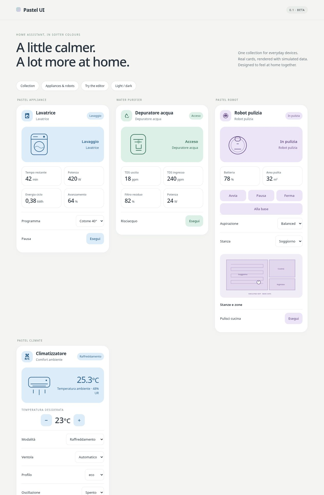

# Pastel UI

A coordinated collection of Home Assistant cards for lights, climate, appliances, robots and household sensors. One HACS installation, with the existing Pastel card types preserved.

[English](#english) · [Italiano](#italiano) · [Card gallery](docs/catalog.md) · [Installation](docs/installation.md) · [Migration](docs/migration.md)

[](https://my.home-assistant.io/redirect/hacs_repository/?owner=Angelofsin666&repository=pastel-ui&category=plugin)



## English

**Status: 0.1 beta.** The cards have been tested with simulated Home Assistant data. Real-device integration testing is the next step. This is a custom HACS repository, not a Home Assistant built-in feature or a HACS default repository.

### What's inside

- **Appliance:** choose a device or entity, review related sensors and controls, and save the associations. Profiles cover laundry, kitchen appliances, air treatment, water heaters and water purifiers.
- **Robot:** capability-based vacuum and mower controls, optional map image, and room/zone selectors or existing scripts/buttons.
- **Climate:** controls derived from the climate entity's modes, temperature limits and supported features. The separate custom-action/IR card remains available.
- **Existing Pastel cards:** lights, buttons, openings, doors/windows, motion, leaks, smoke/CO, temperature, humidity, thermostat, dishwasher and mower keep their current type names.

The bundle contains its rendering libraries: there are no runtime CDN imports. Your existing Home Assistant integrations still determine which device functions and data are available.

### Installation

Open the blue button above with HACS installed. Alternatively, add `https://github.com/Angelofsin666/pastel-ui` under HACS custom repositories, category **Dashboard**. During the beta, enable pre-release versions and choose `v0.1.0-beta.1`, or explicitly download `main`.

Verify that the JavaScript module resource is registered as:

```yaml
url: /hacsfiles/pastel-ui/pastel-ui.js
type: module
```

Reload the frontend, then add a **Pastel Appliance** or **Pastel Robot** card through the visual editor. Select a device or primary entity and use the discovery button. Review the proposed profile, measurements and controls before applying them. The beta editor currently uses Italian labels; the installation and card documentation are bilingual.

Already using individual Pastel cards? Read the [migration guide](docs/migration.md) before switching resources. You should not need to rebuild the dashboard, but resource paths and custom image overrides must be checked.

### Know what is supported

Discovery uses Home Assistant's device and entity registries. Ambiguous matches are left for you to choose. You can assign sensors from an external power meter and add controls manually. A profile does not create entities or unlock unsupported device commands.

Power (W/kW) and energy (Wh/kWh) are separate. Cycle energy requires an existing cycle-energy sensor; this frontend does not calculate persistent cycle totals. Robot maps are images supplied by the integration, not an interactive floor-plan editor. Zone commands use the selectors, buttons or scripts you configure; there are no brand-specific map adapters yet.

[Explore all cards](docs/catalog.md) · [Configuration reference](docs/configuration.md) · [Compatibility and test status](docs/testing.md)

If you try the beta, please report the integration name, device model and which associations worked. Remove personal entity IDs and credentials from reports. If the collection is useful to you, a GitHub star helps others find it.

## Italiano

**Stato: beta 0.1.** Le card sono state provate con dati Home Assistant simulati. Il prossimo passo è la verifica con dispositivi reali. Questa è una repository personalizzata HACS, non una funzionalità ufficiale di Home Assistant né una repository predefinita di HACS.

### Cosa include

- **Appliance:** scegli un dispositivo o un'entità, controlla sensori e comandi associati, poi salva. I profili comprendono lavanderia, cucina, trattamento aria, scaldacqua e depuratori d'acqua.
- **Robot:** comandi per aspirapolvere e tagliaerba basati sulle capacità dichiarate, immagine della mappa opzionale e selettori o script/pulsanti per stanze e zone.
- **Climate:** modalità, limiti di temperatura e controlli letti dall'entità clima. Resta disponibile anche la card con azioni personalizzate/IR.
- **Card Pastel esistenti:** luci, pulsanti, aperture, porte/finestre, presenza, perdite, fumo/CO, temperatura, umidità, termostato, lavastoviglie e tagliaerba mantengono i nomi attuali.

Il pacchetto include le librerie grafiche, senza scaricarle da CDN durante l'uso. Le integrazioni di Home Assistant continuano a determinare le funzioni effettivamente disponibili.

### Installazione

Con HACS installato, usa il pulsante azzurro in alto. In alternativa aggiungi `https://github.com/Angelofsin666/pastel-ui` alle repository personalizzate HACS, categoria **Dashboard**. Durante la beta abilita le versioni preliminari e scegli `v0.1.0-beta.1`, oppure scarica esplicitamente `main`.

Verifica la risorsa JavaScript Module `/hacsfiles/pastel-ui/pastel-ui.js`, poi ricarica l'interfaccia. Aggiungi **Pastel Appliance** o **Pastel Robot** dall'editor visuale, seleziona dispositivo o entità principale e avvia la ricerca. Controlla profilo, dati e comandi proposti prima di applicarli.

Se usi già le singole card, segui la [guida alla migrazione](docs/migration.md). Non dovrebbe essere necessario ricostruire la dashboard, ma vanno verificati risorse e percorsi delle immagini personalizzate.

### Compatibilità

Il riconoscimento usa i registri dispositivi ed entità. Le corrispondenze ambigue restano da scegliere. Puoi collegare un misuratore esterno e aggiungere comandi manualmente; il profilo non crea nuove entità o capacità.

Potenza ed energia sono separate. L'energia del ciclo richiede un sensore dedicato: la card non conserva totali persistenti. La mappa del robot è un'immagine fornita dall'integrazione; le zone usano selettori, pulsanti o script configurati. Non sono ancora presenti adattatori per mappe specifici dei singoli marchi.

[Galleria](docs/catalog.md) · [Configurazione](docs/configuration.md) · [Stato dei test](docs/testing.md)

Tutte le immagini mostrano dati fittizi. Segnalazioni su modello, integrazione e associazioni ci aiutano a migliorare la compatibilità. Se la suite ti è utile, una stella su GitHub aiuta a farla conoscere.
