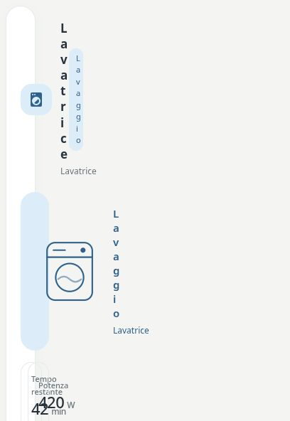

# Pastel Appliance

[](https://my.home-assistant.io/redirect/hacs_repository/?owner=Angelofsin666&repository=pastel-ui&category=plugin)



## English

A device-centred card for household appliances. Review associated sensors, programme selectors and buttons in the visual editor. Power and energy can come from a separate meter.

Included in the single Pastel UI installation. [Install the suite](../installation.md) · [Configuration reference](../configuration.md) · [Migration](../migration.md)

### Example

All entity IDs below are fictional. Replace them with your own. The screenshot is a rendered demo, not evidence of compatibility with a particular brand.

```yaml
type: custom:pastel-appliance-card
profile: washer
title: Lavatrice
entity: sensor.demo_washer
metrics:
  remaining: sensor.demo_washer_remaining
  power: sensor.demo_washer_power
  cycle_energy: sensor.demo_washer_energy
  progress: sensor.demo_washer_progress
controls:
- entity: select.demo_washer_program
  name: Programma
- entity: button.demo_washer_pause
  name: Pausa
```

## Italiano

Una card per elettrodomestici configurata a partire dal dispositivo. Controlla sensori, programmi e pulsanti proposti dall’editor; potenza ed energia possono arrivare da un misuratore esterno.

Inclusa nell’installazione unica di Pastel UI. [Installazione](../installation.md) · [Configurazione](../configuration.md) · [Migrazione](../migration.md)

L’esempio sopra usa soltanto entità fittizie: sostituiscile con le tue. L’immagine mostra la demo e non certifica la compatibilità con un marchio.
