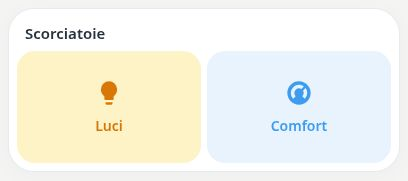

# Pastel Button

[](https://my.home-assistant.io/redirect/hacs_repository/?owner=Angelofsin666&repository=pastel-ui&category=plugin)



## English

Configurable shortcuts for entities, scenes, scripts and navigation. Each button keeps its own label, icon, colour and action.

Included in the single Pastel UI installation. [Install the suite](../installation.md) · [Configuration reference](../configuration.md) · [Migration](../migration.md)

### Example

All entity IDs below are fictional. Replace them with your own. The screenshot is a rendered demo, not evidence of compatibility with a particular brand.

```yaml
type: custom:pastel-button-card
title: Scorciatoie
buttons:
- label: Luci
  icon: mdi:lightbulb
  color: amber
  action:
    type: toggle
    entity_id: light.demo_reading
- label: Comfort
  icon: mdi:thermostat
  color: blue
  action:
    type: more_info
    entity_id: climate.demo
```

## Italiano

Scorciatoie configurabili per entità, scene, script e navigazione. Ogni pulsante mantiene nome, icona, colore e azione.

Inclusa nell’installazione unica di Pastel UI. [Installazione](../installation.md) · [Configurazione](../configuration.md) · [Migrazione](../migration.md)

L’esempio sopra usa soltanto entità fittizie: sostituiscile con le tue. L’immagine mostra la demo e non certifica la compatibilità con un marchio.
