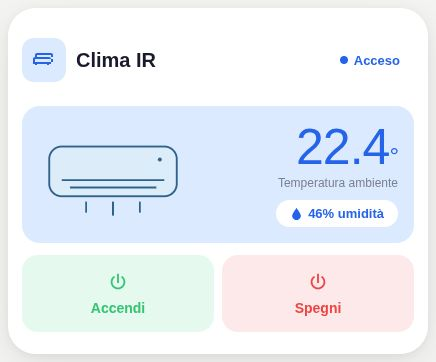

# Pastel Climate · custom actions

[](https://my.home-assistant.io/redirect/hacs_repository/?owner=Angelofsin666&repository=pastel-ui&category=plugin)



## English

The existing custom-action/IR climate controller. Link scripts, switches and state sensors for equipment without a native climate entity. Use Climate for a standard climate entity.

Included in the single Pastel UI installation. [Install the suite](../installation.md) · [Configuration reference](../configuration.md) · [Migration](../migration.md)

### Example

All entity IDs below are fictional. Replace them with your own. The screenshot is a rendered demo, not evidence of compatibility with a particular brand.

```yaml
type: custom:pastel-clima-card
title: Clima IR
color: blue
temp_entity: sensor.demo_temp
hum_entity: sensor.demo_humidity
power_entity: switch.demo_ac
buttons:
- name: Accendi
  icon: mdi:power
  color: green
  action:
    action: perform-action
    perform_action: script.demo_on
- name: Spegni
  icon: mdi:power
  color: red
  action:
    action: perform-action
    perform_action: script.demo_off
```

## Italiano

Il controllo clima esistente con azioni personalizzate/IR. Collega script, interruttori e sensori per dispositivi senza entità climate nativa. Per un’entità standard usa Climate.

Inclusa nell’installazione unica di Pastel UI. [Installazione](../installation.md) · [Configurazione](../configuration.md) · [Migrazione](../migration.md)

L’esempio sopra usa soltanto entità fittizie: sostituiscile con le tue. L’immagine mostra la demo e non certifica la compatibilità con un marchio.
