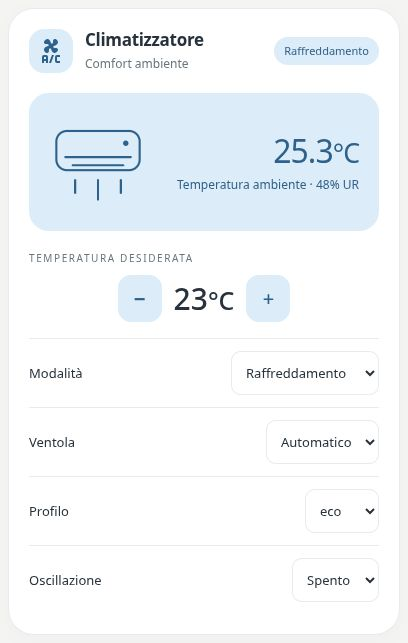

# Pastel Climate

[](https://my.home-assistant.io/redirect/hacs_repository/?owner=Angelofsin666&repository=pastel-ui&category=plugin)



## English

A climate-entity controller with ambient temperature, target temperature, supported HVAC modes, fan settings, presets and swing. Low/high temperature ranges are supported when advertised by the device.

Included in the single Pastel UI installation. [Install the suite](../installation.md) · [Configuration reference](../configuration.md) · [Migration](../migration.md)

### Example

All entity IDs below are fictional. Replace them with your own. The screenshot is a rendered demo, not evidence of compatibility with a particular brand.

```yaml
type: custom:pastel-climate-card
entity: climate.demo
title: Climatizzatore
```

## Italiano

Controllo dell’entità climate con temperatura ambiente, obiettivo, modalità, ventola, profili e oscillazione. Supporta un intervallo minimo/massimo quando dichiarato dal dispositivo.

Inclusa nell’installazione unica di Pastel UI. [Installazione](../installation.md) · [Configurazione](../configuration.md) · [Migrazione](../migration.md)

L’esempio sopra usa soltanto entità fittizie: sostituiscile con le tue. L’immagine mostra la demo e non certifica la compatibilità con un marchio.
