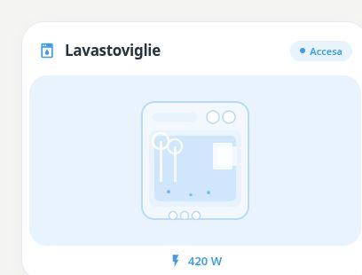

# Pastel Dishwasher

[](https://my.home-assistant.io/redirect/hacs_repository/?owner=Angelofsin666&repository=pastel-ui&category=plugin)



## English

The original dishwasher monitor, preserved for existing dashboards. It shows activity inferred from a power threshold or boolean sensor. Choose Appliance for programme selectors and device controls.

Included in the single Pastel UI installation. [Install the suite](../installation.md) · [Configuration reference](../configuration.md) · [Migration](../migration.md)

### Example

All entity IDs below are fictional. Replace them with your own. The screenshot is a rendered demo, not evidence of compatibility with a particular brand.

```yaml
type: custom:pastel-dishwasher-card
title: Lavastoviglie
color: blue
detection_mode: power
power_entity: sensor.demo_washer_power
```

## Italiano

La card lavastoviglie originale, conservata per le dashboard esistenti. Mostra attività da soglia di potenza o sensore booleano. Per programmi e controlli usa Appliance.

Inclusa nell’installazione unica di Pastel UI. [Installazione](../installation.md) · [Configurazione](../configuration.md) · [Migrazione](../migration.md)

L’esempio sopra usa soltanto entità fittizie: sostituiscile con le tue. L’immagine mostra la demo e non certifica la compatibilità con un marchio.
