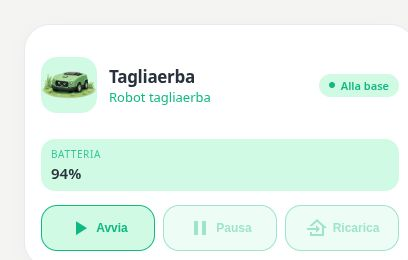

# Pastel Lawn Mower

[](https://my.home-assistant.io/redirect/hacs_repository/?owner=Angelofsin666&repository=pastel-ui&category=plugin)



## English

The original mower card with battery and optional activity sensors. Existing configurations remain available; choose Robot for the new discovery editor and map/zone associations.

Included in the single Pastel UI installation. [Install the suite](../installation.md) · [Configuration reference](../configuration.md) · [Migration](../migration.md)

### Example

All entity IDs below are fictional. Replace them with your own. The screenshot is a rendered demo, not evidence of compatibility with a particular brand.

```yaml
type: custom:pastel-lawn-mower-card
title: Tagliaerba
mower_entity: lawn_mower.demo
battery_entity: sensor.demo_mower_battery
```

## Italiano

La card tagliaerba originale con batteria e sensori opzionali. Le configurazioni restano disponibili; usa Robot per il nuovo editor e le associazioni mappa/zone.

Inclusa nell’installazione unica di Pastel UI. [Installazione](../installation.md) · [Configurazione](../configuration.md) · [Migrazione](../migration.md)

L’esempio sopra usa soltanto entità fittizie: sostituiscile con le tue. L’immagine mostra la demo e non certifica la compatibilità con un marchio.
