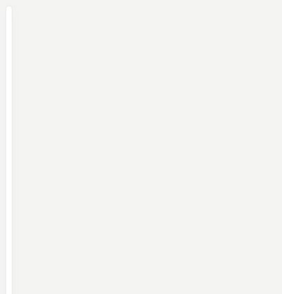

# Pastel Lights

[](https://my.home-assistant.io/redirect/hacs_repository/?owner=Angelofsin666&repository=pastel-ui&category=plugin)



## English

A room’s lights in one card, with a group toggle and per-light brightness. A stationary hold opens more-info; movement cancels the hold. Vertical scrolling over the brightness control does not send a light command.

Included in the single Pastel UI installation. [Install the suite](../installation.md) · [Configuration reference](../configuration.md) · [Migration](../migration.md)

### Example

All entity IDs below are fictional. Replace them with your own. The screenshot is a rendered demo, not evidence of compatibility with a particular brand.

```yaml
type: custom:pastel-lights-card
title: Luci
color: teal
entities:
- light.demo_reading
- light.demo_ceiling
```

## Italiano

Luci della stanza con comando di gruppo e luminosità per ogni luce. Una pressione ferma apre i dettagli; lo spostamento la annulla. Lo scroll verticale sullo slider non invia comandi.

Inclusa nell’installazione unica di Pastel UI. [Installazione](../installation.md) · [Configurazione](../configuration.md) · [Migrazione](../migration.md)

L’esempio sopra usa soltanto entità fittizie: sostituiscile con le tue. L’immagine mostra la demo e non certifica la compatibilità con un marchio.
