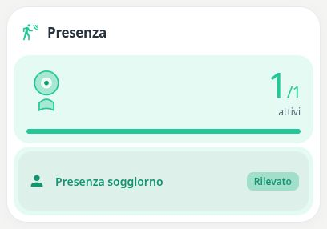

# Pastel Motion & Presence

[](https://my.home-assistant.io/redirect/hacs_repository/?owner=Angelofsin666&repository=pastel-ui&category=plugin)



## English

See active motion and occupancy sensors at a glance. Detection uses the selected pastel accent rather than an alarm-red colour.

Included in the single Pastel UI installation. [Install the suite](../installation.md) · [Configuration reference](../configuration.md) · [Migration](../migration.md)

### Example

All entity IDs below are fictional. Replace them with your own. The screenshot is a rendered demo, not evidence of compatibility with a particular brand.

```yaml
type: custom:pastel-motion-presence-card
title: Presenza
color: teal
entities:
- binary_sensor.demo_motion
```

## Italiano

Mostra sensori di movimento e presenza attivi. La rilevazione usa il colore pastello scelto, non il rosso di allarme.

Inclusa nell’installazione unica di Pastel UI. [Installazione](../installation.md) · [Configurazione](../configuration.md) · [Migrazione](../migration.md)

L’esempio sopra usa soltanto entità fittizie: sostituiscile con le tue. L’immagine mostra la demo e non certifica la compatibilità con un marchio.
