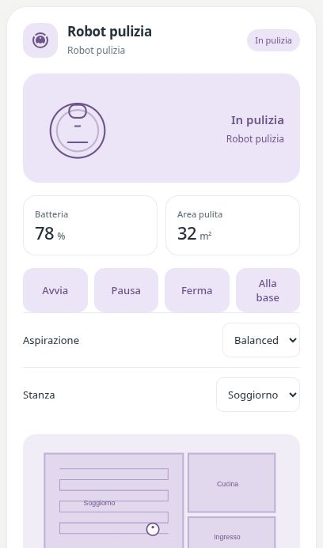

# Pastel Robot

[](https://my.home-assistant.io/redirect/hacs_repository/?owner=Angelofsin666&repository=pastel-ui&category=plugin)



## English

Vacuum and lawn-mower actions follow the entity’s supported features. Link an image/camera entity for a map and select/button/script entities for rooms or zones. No brand-specific map editing is included.

Included in the single Pastel UI installation. [Install the suite](../installation.md) · [Configuration reference](../configuration.md) · [Migration](../migration.md)

### Example

All entity IDs below are fictional. Replace them with your own. The screenshot is a rendered demo, not evidence of compatibility with a particular brand.

```yaml
type: custom:pastel-robot-card
profile: vacuum
entity: vacuum.demo_robot
metrics:
  battery: sensor.demo_robot_battery
  area: sensor.demo_robot_area
controls:
- entity: select.demo_robot_zone
  name: Stanza
map_entity: image.demo_map
zones:
- entity: button.demo_zone_kitchen
  name: Pulisci cucina
```

## Italiano

I comandi di aspirapolvere e tagliaerba seguono le capacità dell’entità. Collega una camera/immagine per la mappa e selettori, pulsanti o script per le zone. Non include un editor di mappe specifico per marca.

Inclusa nell’installazione unica di Pastel UI. [Installazione](../installation.md) · [Configurazione](../configuration.md) · [Migrazione](../migration.md)

L’esempio sopra usa soltanto entità fittizie: sostituiscile con le tue. L’immagine mostra la demo e non certifica la compatibilità con un marchio.
