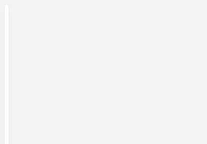

# Pastel Smoke & CO

[](https://my.home-assistant.io/redirect/hacs_repository/?owner=Angelofsin666&repository=pastel-ui&category=plugin)



## English

A binary smoke and carbon-monoxide alarm overview. CO means carbon monoxide, not carbon dioxide (CO₂); numeric CO₂ sensors need a measurement card.

Included in the single Pastel UI installation. [Install the suite](../installation.md) · [Configuration reference](../configuration.md) · [Migration](../migration.md)

### Example

All entity IDs below are fictional. Replace them with your own. The screenshot is a rendered demo, not evidence of compatibility with a particular brand.

```yaml
type: custom:pastel-smoke-co-card
title: Fumo e CO
color: purple
entities:
- binary_sensor.demo_smoke
```

## Italiano

Riepilogo di allarmi binari fumo e monossido di carbonio. CO non significa anidride carbonica (CO₂); i sensori numerici CO₂ richiedono una card di misure.

Inclusa nell’installazione unica di Pastel UI. [Installazione](../installation.md) · [Configurazione](../configuration.md) · [Migrazione](../migration.md)

L’esempio sopra usa soltanto entità fittizie: sostituiscile con le tue. L’immagine mostra la demo e non certifica la compatibilità con un marchio.
