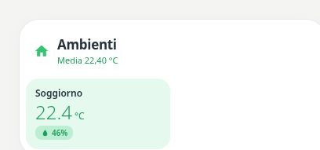

# Pastel Temperature & Humidity

[](https://my.home-assistant.io/redirect/hacs_repository/?owner=Angelofsin666&repository=pastel-ui&category=plugin)



## English

A compact room grid for entities that expose temperature and humidity as attributes. Use Temperature instead if you have two separate sensor entities.

Included in the single Pastel UI installation. [Install the suite](../installation.md) · [Configuration reference](../configuration.md) · [Migration](../migration.md)

### Example

All entity IDs below are fictional. Replace them with your own. The screenshot is a rendered demo, not evidence of compatibility with a particular brand.

```yaml
type: custom:pastel-temp-humidity-card
title: Ambienti
color: green
rooms:
- entity: sensor.demo_room
  name: Soggiorno
```

## Italiano

Griglia compatta per entità che espongono temperatura e umidità come attributi. Usa Temperature se hai due sensori separati.

Inclusa nell’installazione unica di Pastel UI. [Installazione](../installation.md) · [Configurazione](../configuration.md) · [Migrazione](../migration.md)

L’esempio sopra usa soltanto entità fittizie: sostituiscile con le tue. L’immagine mostra la demo e non certifica la compatibilità con un marchio.
