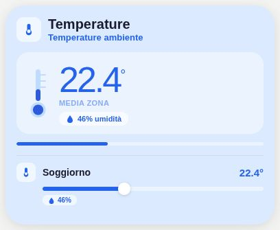

# Pastel Temperature

[](https://my.home-assistant.io/redirect/hacs_repository/?owner=Angelofsin666&repository=pastel-ui&category=plugin)



## English

A temperature overview using separate temperature and humidity sensor entities for each room. Optional history-based trends remain available.

Included in the single Pastel UI installation. [Install the suite](../installation.md) · [Configuration reference](../configuration.md) · [Migration](../migration.md)

### Example

All entity IDs below are fictional. Replace them with your own. The screenshot is a rendered demo, not evidence of compatibility with a particular brand.

```yaml
type: custom:pastel-temp-card
title: Temperature
color: blue
show_trend: false
rooms:
- name: Soggiorno
  temp_entity: sensor.demo_temp
  hum_entity: sensor.demo_humidity
```

## Italiano

Riepilogo con sensori di temperatura e umidità separati per ogni stanza. Restano disponibili gli andamenti opzionali basati sullo storico.

Inclusa nell’installazione unica di Pastel UI. [Installazione](../installation.md) · [Configurazione](../configuration.md) · [Migrazione](../migration.md)

L’esempio sopra usa soltanto entità fittizie: sostituiscile con le tue. L’immagine mostra la demo e non certifica la compatibilità con un marchio.
