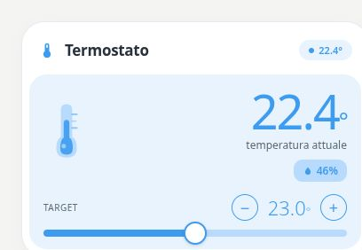

# Pastel Thermostat

[](https://my.home-assistant.io/redirect/hacs_repository/?owner=Angelofsin666&repository=pastel-ui&category=plugin)



## English

A configurable target controller using measurement entities and custom actions. Target changes are committed on release; vertical scrolling is allowed. The configured target service must match your target entity.

Included in the single Pastel UI installation. [Install the suite](../installation.md) · [Configuration reference](../configuration.md) · [Migration](../migration.md)

### Example

All entity IDs below are fictional. Replace them with your own. The screenshot is a rendered demo, not evidence of compatibility with a particular brand.

```yaml
type: custom:pastel-thermostat-card
title: Termostato
temperature_entity: sensor.demo_temp
humidity_entity: sensor.demo_humidity
target_entity: input_number.example_target
target_service: input_number.set_value
```

## Italiano

Controllo di un obiettivo con sensori e azioni configurabili. Le modifiche vengono inviate al rilascio e lo scroll verticale resta possibile. Il servizio configurato deve corrispondere all’entità obiettivo.

Inclusa nell’installazione unica di Pastel UI. [Installazione](../installation.md) · [Configurazione](../configuration.md) · [Migrazione](../migration.md)

L’esempio sopra usa soltanto entità fittizie: sostituiscile con le tue. L’immagine mostra la demo e non certifica la compatibilità con un marchio.
