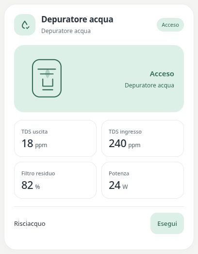

# Water purifier

[](https://my.home-assistant.io/redirect/hacs_repository/?owner=Angelofsin666&repository=pastel-ui&category=plugin)



## English

Use the water_purifier profile to display inlet/outlet TDS, filter life, tank level, dispensed water and power. Add a rinse button only if your integration exposes one.

Included in the single Pastel UI installation. [Install the suite](../installation.md) · [Configuration reference](../configuration.md) · [Migration](../migration.md)

### Example

All entity IDs below are fictional. Replace them with your own. The screenshot is a rendered demo, not evidence of compatibility with a particular brand.

```yaml
type: custom:pastel-appliance-card
profile: water_purifier
entity: sensor.demo_water
metrics:
  water_quality: sensor.demo_water_tds_out
  water_input: sensor.demo_water_tds_inlet
  filter: sensor.demo_water_filter_remaining
  power: sensor.demo_water_power
controls:
- entity: button.demo_water_flush
  name: Risciacquo
```

## Italiano

Il profilo water_purifier mostra TDS ingresso/uscita, vita filtro, serbatoio, acqua erogata e potenza. Aggiungi il risciacquo solo se l’integrazione espone il comando.

Inclusa nell’installazione unica di Pastel UI. [Installazione](../installation.md) · [Configurazione](../configuration.md) · [Migrazione](../migration.md)

L’esempio sopra usa soltanto entità fittizie: sostituiscile con le tue. L’immagine mostra la demo e non certifica la compatibilità con un marchio.
